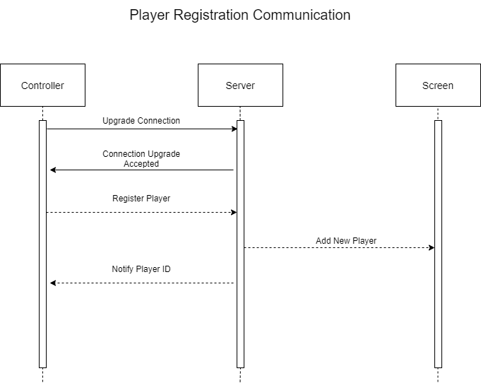

# This files describe how each devices in the game (screen, server, controller) communicate

## Registering New Player

### Message Format
* Connection Upgrade Message:
```
Websocket Connect
```
* Connection Upgrade Accepted:
```
Websocket Accept
```
* Register Player:
```
{
  "action": "add_player"
} 
```
* Add New Player:
```
{
  "action": "register_player",
  "players": [
    {
      "id": 1,
      "score": 0
    }
  ]
}
```
* Notify Player ID:
```
{
  message: "player registration accepted",
  id: 1,
  action: "assign_id"
}
```