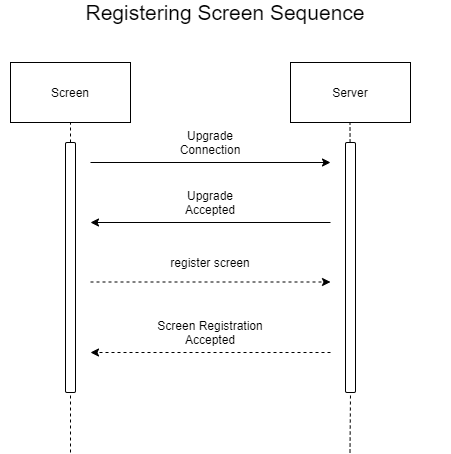

# This files describe how each devices in the game (screen, server, controller) communicate

## Common Message Format
* Connection Upgrade Message:
```
Websocket Connect, Handled by WebSocket
```
* Connection Upgrade Accepted:
```
Websocket Accept, Handled by WebSocket
```
* Basic Message Format:
```
format in JSON
{
  "id": "this key specify who sends the message",
  "action": "this key will be used to determine what action is being sent",
  "message": "success or error message",
  #the rest is context specific message
}
```

## Registering New Player

### Message Format
* Register Player:
```
{
  "action": "add_player"
} 
```
* Add New Player:
```
{
  "action": "register_player",
  "players": [
    {
      "id": 1,
      "score": 0
    }
  ]
}
```
* Notify Player ID:
```
{
  "message": "player registration accepted",
  "id": 1,
  "action": "assign_id"
}
```

## Registering Screen

### Message Format
* Register Screen:
```
{ "action": "add_screen" }
```
* Screen Registration Accepted:
```
{ "message": "screen registered" }
```
